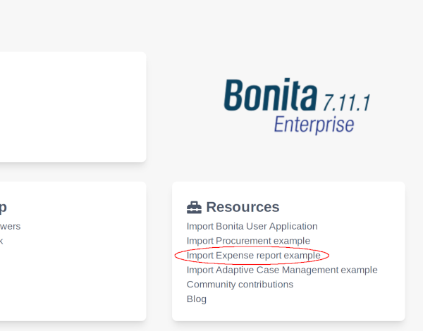
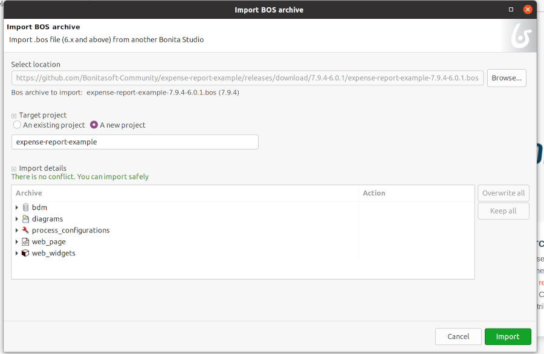
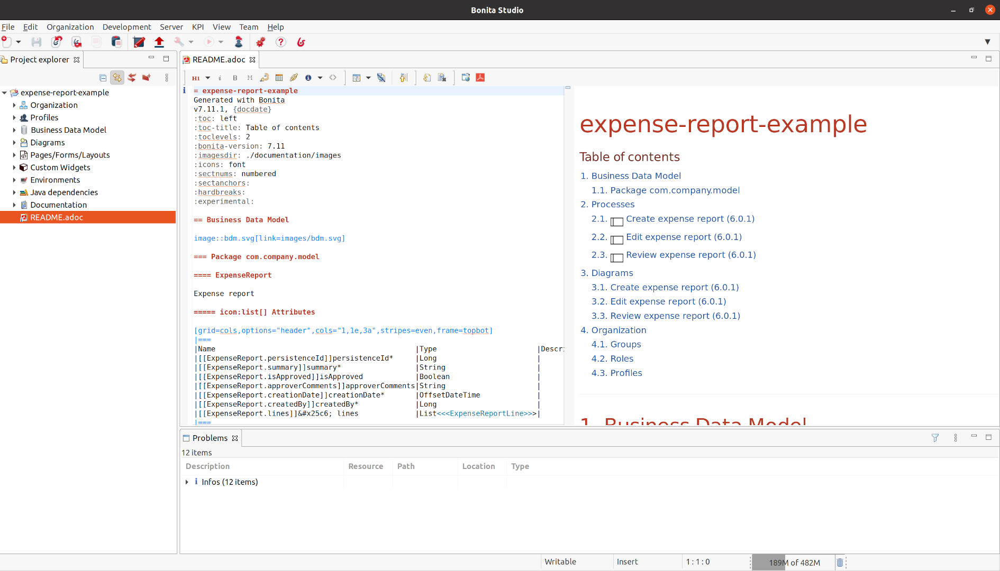
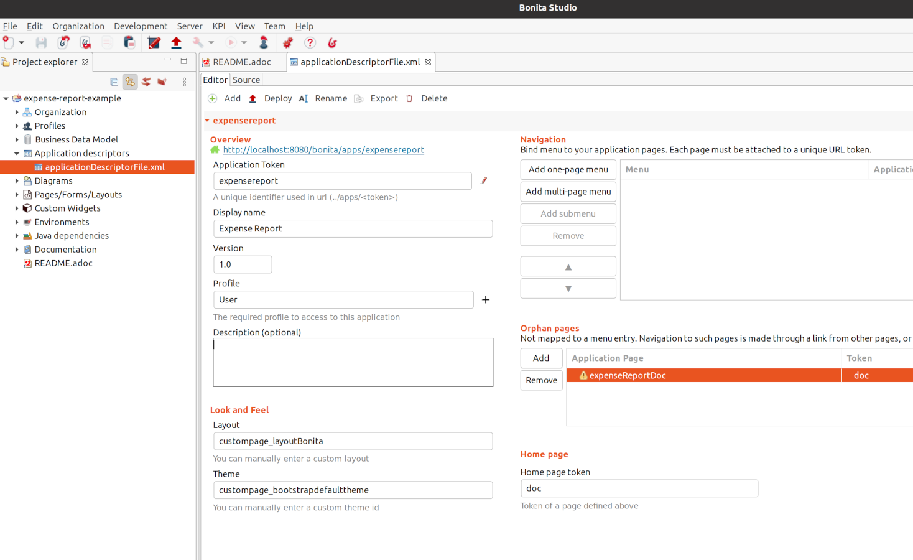
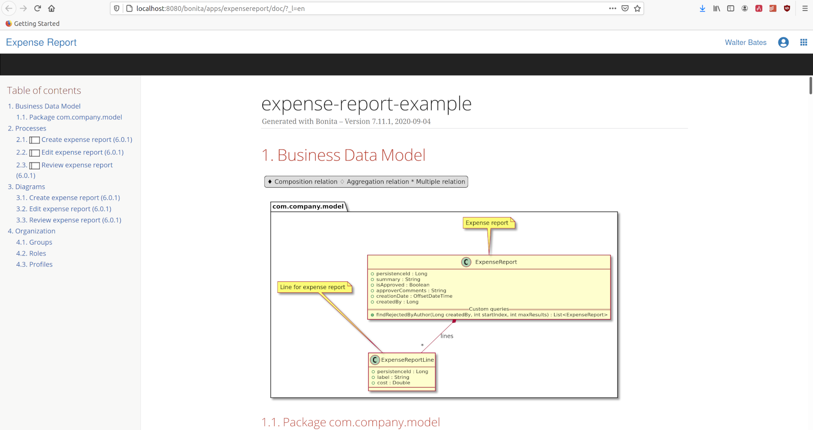

# Publish your Bonita project documentation using Bonita !

In Bonita 7.11, the Enterprise Studio have revamp its documentation generation tooling. 
It now uses the Groovy template engine to extract your project data and generate an asciidoc document.  
Let's dig into the tooling provided by asciidoctor to publish and share your project doc in a Living app !

## What is Asciidoc ?

If you don't know AsciiDoc you might know its little brother Markdown. They are two markup languages based on the same concept, plain text documents focused on content and conciseness.
You can check the main differences between the two on the [Asciidoctor official site](https://asciidoctor.org/docs/asciidoc-vs-markdown/).  

## Bonita + AsciiDoctor = ♥

When you open your project with Bonita Studio 7.11+, a new Documentation generation feature is available.
What it does is:

* Convert all your diagram and processes into images assets
* Generate a Class diagram of your BDM and an svg image of this diagram using plantuml ([GraphViz](https://graphviz.org/) need to be installed)
* Extract all the project models information and format into a structured asciidoc document

The result is a new `README.adoc` file at the root of your project and a `documentation` folder containing all the assets.  
The Studio comes with an integrated Asciidoc editor that offers syntax highlighting and a live preview. You can also export the document as PDF or preview it in a external browser.
What about going further ?

Let's build a custom page embedding this doc !

For this example I am going to use the [asciidoctor-maven-plugin](https://asciidoctor.org/docs/asciidoctor-maven-plugin/) to generate an html output but be aware that a lot of other tools and formats exists (ePub3, pdf, docbook, html, latex...).

<a name="clone"></a>

## Clone the documentation-page-builder

First you can clone this git [repository](https://github.com/rbioteau/documentation-page-builder) that contains everything you need. It is a maven with a preconfiguration of the asciidoctor-maven-plugin for Bonita custom page generation.

To do that you need [Git](https://git-scm.com/downloads) installed on your computer.

Then **open a terminal** in a folder of your choice a execute the clone command:

`> git clone https://github.com/rbioteau/documentation-page-builder`

Change the active directory:

`> cd documentation-page-builder`

Keep that terminal here, we will need it later on.

## Expense report example

Let's try that on the Expense Report example ! To have the best possible result don't forget to install [GraphViz](https://graphviz.org/) on your computer first.

1. **Open** your Bonita Studio (Subscription 7.11.0+)

1. **Import** the Expense report example from the welcome page



An import dialog opens, create a new project with the content of the example like this:



**Click on Import**

1. Once the project imported go to `File` menu and click on `Generate documentation`. Wait a few seconds (all diagrams and processes are transformed into images)...

You should now have something like this:



Here you go with the basic generated doc for this project, you can customize the output of the generation manipulating templates but that's for another day. 

1. Now we want to publish this doc in a Living app.

So go back to the `documentation-page-builder` terminal (if you haven't cloned it yet, [do that now !](#clone)), and **execute** the build using the following command line:

```
> ./mvnw package -DprojectDirectory=<Absolute path to your Studio install location>\workspace\expense-report-example \
                 -Dpage.name=expenseReportDoc \
                 -Dpage.displayName="Expense report documentation page"
```

Build success ! Look for the `expenseReportDoc-1.0-page.zip` archive in the `target` folder of `documentation-page-builder`. That's our custom page.

1. To publish it, you can now connect as an Administrator on the Bonita Portal. I am going to use the Portal run with my Studio for this example.

**Navigate** to the `Resources` page


**Click** on `+ Add`, **click** on the upload file widget and **browse** to the custom page in `target` folder. **Hit** `Next >` and `Confirm`.
Now that the page is installed. You can map it to a Living app.

1. **Return in your Studio** and **create** an Application descriptor for `expense-report-project`(*Development/Application Descriptor/New*). Here is a preview of mine:



As you can see I've just manually added an orphan page using the technical name `custompage_expenseReportDoc` and a `doc` token. A warning is displayed because this page is not found in the project sources, it is normal as we have installed the page using the Portal. For the sake of the example I use the `User` profile for my app but you may want to use a custom profile in a real world scenario.

**Click** on `Deploy` and **open** `Expense Report as User`.
You should be redirected to this page in your browser:



And that's it, your doc is published and all the users with the `User` profile can access it via your Bonita plaftform !

If you like that feature and want to know more there is a [documentation article on our website](https://documentation.bonitasoft.com/bonita/7.11/project-documentation-generation). Leave a comment if you have any question on the topic and let me know if your are interested on advanced template customization.

Have fun with Bonita ;)

Romain Bioteau
Senior R&D Software Engineer @Bonitasoft


